# Overview

## Course content

This course will enable you to:

- Build your own mosquitto container image
- Deploy the mosquitto broker on IBM Code Engine
- Develop a publisher app in Python
- Develop and deploy your subscriber app in Python
- Persist messages via the subscriber app in an IBM Cloudant database
- Query data from the IBM Cloudant database

## Architecture

## Sequence Diagram

<picture>
    <source srcset="./files/sequence-diagram_light.svg" media="(prefers-color-scheme: dark)">
    <source srcset="./files/sequence-diagram_dark.svg" media="(prefers-color-scheme: light)">
    
</picture>

## Platform-specific Guides

- **Windows Users**: See the [Windows Environment Setup Guide](./8_Windows-Environment-Setup.md) for detailed instructions on environment variables and command-line differences.
- **All Platforms**: Follow the course modules in sequence starting with [Prerequisites](./1_Pre-requisites.md).
